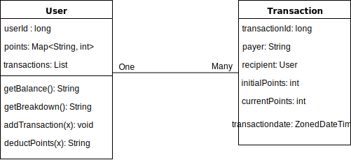

# Application Design of UserPoints

## Project Requirements (verbatim)

Our users have points in their accounts. Users only see a single balance in their accounts. But for reporting purposes we actually track their points per payer/partner. In our system, each transaction record contains: payer name(string), points (integer), transactionDate (Date).

For earning points it is easy to assign a payer, we know which actions earned the points. And thus which partner should be paying for the points.

When a user spends points, they don't know or care which payer the points come from. But, our accounting team does care how the points are spent. There are two rules for determining what points to "spend" first:

We want the oldest points to be spent first
We want no payer's points to go negative

Provide routes that:

* Add points to user account for specific payer and date
* Deduct points from the user account using above constraints and return a list of [payer, points deducted] for each call to spend points
* Return point balance per user that would list all positive points per payer

## Example

Suppose you call your add points route with the following sequence of calls:

* **add** [DANNON, 300 points, 10/31 10AM] to user
* **add** [UNILEVER, 200 points, 10/31 11AM] to user
* **add** [DANNON, -200 points, 10/31 3PM] to user
* **add** [MILLER COORS, 10,000 points , 11/1 2PM] to user
* **add** [DANNON, 1000 points, 11/2 2PM] to user

Then you call your deduct points route with the following request:

* **deduct** 5000 points from user

The expected response from the deduct call would be:

* [DANNON, -100 points, now]
* [UNILEVER, -200 points, now]
* [MILLER COORS, -4,700 points, now]

A subsequent query to the points balance route, after the deduction, should returns the following results:

* DANNON, 1000 points
* UNILEVER, 0 points
* MILLER COORS, 5,300 points

## Use Cases

* A user account should be creatable, as the requirements state *"return point balance per user"*
* Payer must be able to make transactions to a specific user account
  * **Unknown:** Should payers be anonymous objects?
  * Transactions must be individual based on date and time
  * Amounts in transactions can be nonpositive
  * Transactions should keep track of date and time
* A user can deduct points from a specific user account
  * Only the amount deducted is required
  * Transaction history to achieve deduction must be displayed
  * The oldest points have highest priority in deduction
* An accountant can view the balance of an account, and the breakdown. A user can only see the total balance
  * **Unknown:** Should this list be in a certain order?
  * **Unknown:** How should we differeniate users and accountants? What authorization logic should be used?

## Entity Relationships

